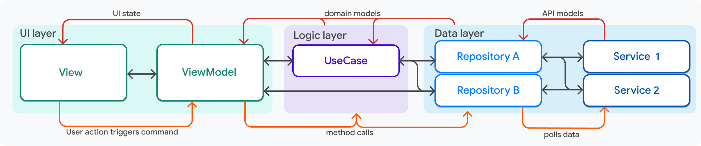

# アプリケーション・アーキテクチャ

将来的なアップデート・スケールを容易にするため、Flutter公式が推奨するアーキテクチャを採用します。

## 共通アーキテクチャコンセプト

[Common architecture concepts](https://docs.flutter.dev/app-architecture/concepts)

以下の `レイヤードアーキテクチャ` を採用します。

```
┏━━━━━┓ <-------- ┏━━━━━━━┓ <--State-- ┏━━━━━━┓
┃ UI Layer ┃           ┃ Logic Layer  ┃            ┃ Data Layer ┃
┗━━━━━┛--Event--> ┗━━━━━━━┛ ---------> ┗━━━━━━┛
```

依存関係は `UI Layer` -> `Logic Layer` -> `Data Lanyer` の一方向です。

##  階層型アーキテクチャ

[アプリアーキテクチャガイド](https://docs.flutter.dev/app-architecture/guide)

MVVMアーキテクチャを採用します。

- View
- ViewModel
- UseCase
- Repository
- Service



ユースケースを追加するこの方法は、以下のルールによって定義されます。

- ユースケースはリポジトリに依存する
- ユースケースとリポジトリは多対多の関係にある
- ビューモデルは、1つ以上のユースケース と 1つ以上のリポジトリに依存します。

## レイヤー間通信

| 成分         | 交戦規則                                                                                                                                                                                                                                     |
|--------------|----------------------------------------------------------------------------------------------------------------------------------------------------------------------------------------------------------------------------------------------|
| ビュー       | ビューは、ビューモデルを1つだけ認識し、他のレイヤーやコンポーネントを認識することはありません。Flutterはビューモデルを作成する際に、ビューモデルを引数としてビューに渡し、ビューモデルのデータとコマンドコールバックをビューに公開します。   |
| ビューモデル | ViewModelは必ず1つのビューに属し、そのビューはViewModelのデータを参照できますが、モデル自体はビューの存在を知る必要はありません。<br />ビューモデルは、1つ以上のリポジトリを認識しており、それらはビューモデルのコンストラクタに渡されます。 |
| リポジトリ   | リポジトリは、リポジトリのコンストラクタに引数として渡される多くのサービスを認識できます。<br />リポジトリは多くのビューモデルで使用できますが、リポジトリ自体がそれらのビューモデルを認識する必要はありません。                             |

## DI

[依存性注入](https://docs.flutter.dev/app-architecture/case-study/dependency-injection#dependency-injection)
