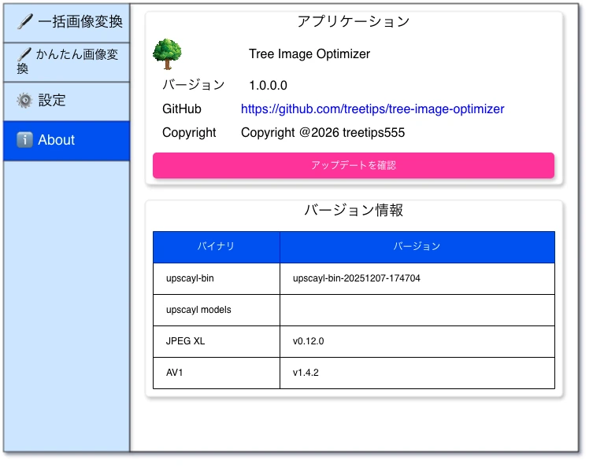

# About画面



## ✳️アプリケーション

- 表形式で表示します。

### ✏️ アプリケーション名

#### 静的ラベル

- 固定で `アプリケーション名` と表示。

#### 静的ラベル

- アイコン `assets/images/icon-tree-01.png` を `縦50px（アスペクト比を維持）` で表示。
- 固定で `Tree Image Optimizer` と表示。

### ✏️ バージョン番号

#### 静的ラベル

- 固定で `バージョン` と表示。

#### 動的ラベル

- `1.0.0` の部分はアプリケーションのバージョン番号です。
- `Major` `Minor` `Patch` を使った [セマンティックバージョニング](https://semver.org/lang/ja/) を採用します。

#### バージョニング例

```
1.0.0 : 初期バージョン
1.0.1 : バグを修正した
1.1.0 : 機能強化を行った
1.1.1 : 機能強化のバグを修正した
2.0.0 : 互換性を保証できない大きな機能強化を行った
```

### ✏️ GitHub

#### 静的ラベル

- 固定で `GitHub` と表示。

#### 動的ラベル

- リンク形式（クリックでブラウザが開く）で `https://github.com/treetips/tree-image-optimizer` を表示します。

### ✏️ copyright

#### 静的ラベル

- 固定で `Copyright @2026 treetips555` と表示。

### ✏️ アップデートを確認

表の下（カード内）に表示します。

#### ボタン

- `アップデートを確認` ボタンをクリックすると、 [auto_updater](https://pub.dev/packages/auto_updater) でアップデートチェックをします。
    - アップデートが有る場合は `auto_updater` のフローで更新する。
    - アップデートが無い場合は `お使いのバージョンは最新バージョンです。` を表示する。
- `アップデートを確認` ボタンをクリックすると、ボタンアイコンをローディングにし非活性にする。正常・異常に関わらず、処理が完了したらボタンを元の状態に戻す。

### アップデート結果

#### alert

- `アップデートボタン` をクリックした際に表示します。初期状態で非表示です。色ルールは [共通_alert](./common.md) を参照。
- 一度alertが表示されると、左サイドナビでメニューをクリックして別画面に遷移しても表示されっぱなしになります。
- 既にalertが表示されている状態から再度 `アップデートを確認ボタン` をクリックした場合、最新の情報でalertが置き換わります。

## ✳️ バージョン情報

- 表形式で表示します。

### ✏️ upscal-bin

#### 静的ラベル

- `upscal-bin` という静的ラベルを表示します。

#### 動的ラベル

- 現在のバージョンを表示します。
- バージョン番号はGitHub Releasesの `タグ名` です。
- バージョン番号はFlutterの定数クラスで管理するので、そこから取得します。

### ✏️ upscal models

#### 静的ラベル

- `upscal models` という静的ラベルを表示します。

#### 動的ラベル

- `models` はGitHub Releasesで管理されていないので、固定で空欄にします。

### ✏️ JPEG

#### 静的ラベル

- `JPEG (jpegoptim)` という静的ラベルを表示します。

#### 動的ラベル

- 現在のバージョンを表示します。
- バージョン番号はGitHub Releasesの `タグ名` です。
- バージョン番号はFlutterの定数クラスで管理するので、そこから取得します。

### ✏️ PNG

#### 静的ラベル

- `PNG (pngoptim)` という静的ラベルを表示します。

#### 動的ラベル

- 現在のバージョンを表示します。
- バージョン番号はGitHub Releasesの `タグ名` です。
- バージョン番号はFlutterの定数クラスで管理するので、そこから取得します。

### ✏️ JPEG XL

#### 静的ラベル

- `JPEG XL (libjxl)` という静的ラベルを表示します。

#### 動的ラベル

- 現在のバージョンを表示します。
- バージョン番号はGitHub Releasesの `タグ名` です。
- バージョン番号はFlutterの定数クラスで管理するので、そこから取得します。

### ✏️ AV1

#### 静的ラベル

- `AV1 (libavif)` という静的ラベルを表示します。

#### 動的ラベル

- 現在のバージョンを表示します。
- バージョン番号はGitHub Releasesの `タグ名` です。
- バージョン番号はFlutterの定数クラスで管理するので、そこから取得します。

### ✏️ WebP

#### 静的ラベル

- `WebP (libwebp)` という静的ラベルを表示します。

#### 動的ラベル

- 現在のバージョンを表示します。
- バージョン番号はFlutterの定数クラスで管理するので、そこから取得します。
