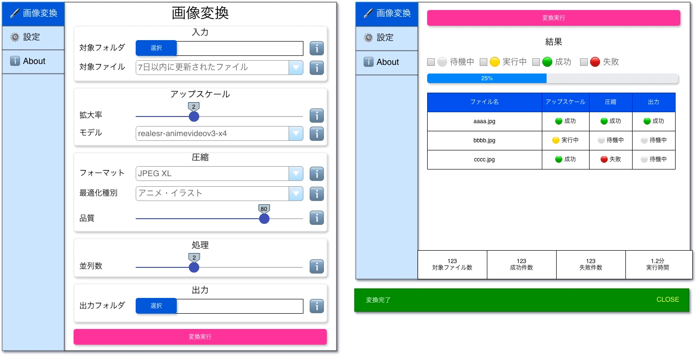

# 画像変換画面


画面は縦に長いので、スクロールが発生します。

## ✳️ 入力

### ✏️ 対象フォルダ

#### 静的ラベル

- `対象フォルダ` という静的ラベルを表示します。

#### 選択ボタン

- `フォルダ` を選択させます。このフォルダに存在する画像ファイル一式が対象ファイルになります。

#### 対象テキストボックス

- `選択ボタン` で選択したフォルダのパスが表示されます。
- 自分でパスを入力することも可能です。
- onChange で `対象テキストボックス` に入力されたパスが存在するかをチェックします。
  - 存在しない場合、テキストボックスのボーダーをバリデーションエラーの `赤色` に設定ます。
  - 存在する場合、テキストボックスのボーダーを通常に戻します。

#### ℹ️

- ホバーするとpopoverに説明が表示される。
- 「対象フォルダ内のファイル一覧が対象になります。」というテキストが記述されていること。

### ✏️ 対象ファイル

#### 静的ラベル

- `対象ファイル` という静的ラベルを表示します。

#### 対象プルダウン

- 対象ファイルの中から、n日以内に更新されたファイルのみを対象とする、絞り込みを行うことができます。
- 選択肢は以下の通りです。
  - 1日以内に更新されたファイル
  - 3日以内に更新されたファイル
  - 7日以内に更新されたファイル
  - 30日以内に更新されたファイル
  - 全ファイル

#### ℹ️

- ホバーするとpopoverに説明が表示される。
- 「対象ファイルを絞り込むと処理する対象が減り、高速化します。」というテキストが記述されていること。

## ✳️ アップスケール

### ✏️ 拡大率

#### 静的ラベル

- `拡大率` という静的ラベルを表示します。

#### 拡大率スライダー

- 最小 = `1` 、 最大 = `4` のスライダーです。例えば `2` だと `画像を2倍のサイズに拡大` します。アスペクト比は維持されます。
- 初期値は `2` です。
- 2 ~ 3 までのスライダーメモリを黄色で表示、 3 ~ 4 までのスライダーメモリを赤色で表示します。

#### ℹ️

- ホバーするとpopoverに説明が表示される。
- 「拡大する程処理速度が低下し、ファイルサイズが大きくなります。」というテキストが記述されていること。

### ✏️ モデル

#### 静的ラベル

- `モデル` という静的ラベルを表示します。

#### モデルプルダウン

- アップスケールのモデルによって、得意な画像の種類が異なります。
- 選択肢は [upscale models](./initial-data.md) を表示します。
  ```
  .rw-r--r--@  67M tester  2 Aug 01:03   --  4x_NMKD-Siax_200k.bin
  .rw-r--r--@ 108k tester  2 Aug 01:03   --  4x_NMKD-Siax_200k.param
  .rw-r--r--@  67M tester  2 Aug 01:03   --  4x_NMKD-Superscale-SP_178000_G.bin
  .rw-r--r--@ 108k tester  2 Aug 01:03   --  4x_NMKD-Superscale-SP_178000_G.param
  .rw-r--r--@  33M tester  2 Aug 01:03   --  4xHFA2k.bin
  .rw-r--r--@ 108k tester  2 Aug 01:03   --  4xHFA2k.param
  ```
  例えば上記の場合、以下を選択肢として表示してください。
    - 4x_NMKD-Siax_200k
    - 4x_NMKD-Superscale-SP_178000_G
    - 4xHFA2k
- 初期値はアニメに強い `realesr-animevideov3-x4` です。

#### ℹ️

- ホバーするとpopoverに説明が表示される。
- 「realesr-animevideov3-x4がアニメに強いモデルです。」というテキストが記述されていること。

## ✳️ 圧縮

### ✏️ フォーマット

#### 静的ラベル

- `フォーマット` という静的ラベルを表示します。

#### フォーマットプルダウン

- アップスケールしただけだとファイルサイズが大きいので、圧縮率が高く劣化が少ない圧縮処理を行います。
- 選択肢は以下の通りです。
  - JPEG
  - PNG
  - JPEG XL
  - AV1
- 初期値は `JPEG XL` です。

#### ℹ️

- ホバーするとpopoverに説明が表示される。
- 「JPEG XLはアニメに強く、圧縮速度も速く、劣化を抑えることができます。」というテキストが記述されていること。

### ✏️ 最適化種別

#### 静的ラベル

- `最適化種別` という静的ラベルを表示します。

#### 最適化種別プルダウン

- JPEG XLやAV1のオプションで、画像の傾向（アニメや実写等）によって最適な数値が異なります。
- 選択肢は以下の通りです。
  - アニメ・イラスト
  - 実写・写真
  - 速度優先
  - 画質優先

#### ℹ️

- ホバーするとpopoverに説明が表示される。
- 「アニメや実写など、種別によって適したパラメータで圧縮します。」というテキストが記述されていること。

### ✏️ 品質

#### 静的ラベル

- `品質` という静的ラベルを表示します。

#### 品質スライダー

- `100` の場合は圧縮率は最低で、劣化は最小ですがファイルサイズが大きくなります。
- 最小 = `1` 、 最大 = `100` のスライダーです。
- 初期値は `80` です。劣化が少なく速度も速くバランスが取れている数字です。
- 80 ~ 90 までのスライダーメモリを黄色で表示、 90 ~ 100 までのスライダーメモリを赤色で表示します。

#### ℹ️

- ホバーするとpopoverに説明が表示される。
- 「JPEG XLはアニメに強く、圧縮速度も速く、劣化を抑えることができます。」というテキストが記述されていること。

## ✳️ 処理

### ✏️ 並列数

#### 静的ラベル

- `並列数` という静的ラベルを表示します。

#### スライダー

- 最小を `1` 、 最大を `CPUのコア数` とします。
  - [Platform.numberOfProcessors](https://api.dart.dev/dart-io/Platform/numberOfProcessors.html) で取得します。
- デフォルト値は `最大コア数の半分マイナス1` を指定してください。
- スライダーに現在の設定値を表示してください。
- 例えばコア数が16の場合、まずは15を4分割（メモリを4個にしたいのではなく、メモリを何個分色を変えるかの判断です）し、以下のブロック毎に色を決めます。
  - 1 ~ 2分割目までのメモリを青色
  - 2 ~ 3分割目までのメモリを黄色
  - 3 ~ 4分割目までのメモリを赤色

## ✳️ 出力

### ✏️ 出力フォルダ

#### 静的ラベル

- `出力フォルダ` という静的ラベルを表示します。

#### 選択ボタン

- `フォルダ` を選択させます。このフォルダに圧縮したファイルを出力します。

#### 対象テキストボックス

- `選択ボタン` で選択したフォルダのパスが表示されます。
- 自分でパスを入力することも可能です。
- onChange で `対象テキストボックス` に入力されたパスが存在するかをチェックします。
  - 存在しない場合、テキストボックスのボーダーをバリデーションエラーの `赤色` に設定ます。
  - 存在する場合、テキストボックスのボーダーを通常に戻します。

#### ℹ️
- ホバーするとpopoverに説明が表示される。
- 「出力先に既に同一のファイル名が存在する場合、上書きコピーされます。」というテキストが記述されていること。

## ✳️ 実行

### ✏️ 実行ボタン

- `実行` という静的ラベルをボタンに表示します。
- `実行ボタン` をクリックすると、 `実行ボタン` に `ローディングアイコン` を表示し、ボタンの多重クリック防止のためにreadonlyにします。処理が終了したら、 `ローディングアイコン` を非表示に、readonlyを解除します。
- 初期状態では非活性で、`入力_対象フォルダ` `出力_出力フォルダ` を選択済みで、テキストボックスのバリデーションエラーが無い場合のみ、活性化されます。
- 全ての変換が完了したら、以下の種類のスナックバーに `変換完了` と表示します。5秒後に自動で非表示になります。
  - 全ファイル成功したら `緑色背景` で表示します。
  - 1ファイルでも失敗したら `赤色背景` で表示します。
- 実行ボタンクリック時に、 `結果` の要素全てを `初期値` に戻してから変換を実行します。
- 実行ボタンクリック時に、 `実行結果` が画面の上部になるように自動スクロールしてください。

#### 変換完了時のアクション

##### OSの通知

設定画面で `OSの通知を表示する` にチェックが付いている場合、OSの通知を表示します。

- 全ファイル変換成功した場合
  - 通知のタイトル: `tree-image-optimizer`
  - 通知の本文: `🟢 変換処理が成功しました。`
- 1ファイルでも変換が失敗している場合
  - 通知のタイトル: `tree-image-optimizer`
  - 通知の本文: `🔴 変換処理が失敗しました。`

##### サウンドの再生

設定画面で `サウンドを再生する` にチェックが付いている場合、サウンドを再生します。

- 全ファイル変換成功した場合
  - `設定画面` で選択した `成功時のサウンド` を再生します。
- 1ファイルでも変換が失敗している場合
  - `設定画面` で選択した `失敗時のサウンド` を再生します。

#### 処理フロー

[変換処理フロー](./convert-flow/convert-flow.md)

## ✳️ 実行結果

### ✏️ ⚪ 待機中チェックボックス

- 実行結果の表を絞り込んで表示する機能です。
- 1行単位で絞り込み判定をします。
- `アップスケール` `圧縮` `出力` の中で、一つでも対象を含む場合、その行を表示対象として残し、含まない場合はその行を非表示にします。  
- 初期値で全てのチェックボックスにチェックが付いているので、全件表示されている状態です。

#### 静的ラベル

- `⚪ 待機中` という静的ラベルを表示します。

#### 待機中チェックボックス

- チェックを付けると、実行結果の表を `待機中` で絞り込みます。
- 初期値は `チェック済み` です。

### ✏️ 🟡 実行中チェックボックス

#### 静的ラベル

- `🟡 実行中` という静的ラベルを表示します。

#### 待機中チェックボックス

- チェックを付けると、実行結果の表を `実行中` で絞り込みます。
- 初期値は `チェック済み` です。

### ✏️ 🟢 成功チェックボックス

#### 静的ラベル

- `🟢 成功` という静的ラベルを表示します。

#### 待機中チェックボックス

- チェックを付けると、実行結果の表を `成功` で絞り込みます。
- 初期値は `チェック済み` です。

### ✏️ 🔴 失敗チェックボックス

#### 静的ラベル

- `🔴 失敗` という静的ラベルを表示します。

#### 待機中チェックボックス

- チェックを付けると、実行結果の表を `失敗` で絞り込みます。
- 初期値は `チェック済み` です。

### ✏️ 進捗表

- `進捗表` ・ `進捗率` ・ `結果表` は `リアルタイム` に更新されます。
- 表の高さは最大 `300px` とし、それ以上の場合はスクロールバーを表示してください。

#### 1列目 ファイル名

- 対象ファイルのファイル名を表示する。

#### 2列目 アップスケール

- `⚪ 待機中` `🟡 実行中` `🟢 成功` `🔴 失敗` の4種類のいずれかを表示します。
- 初期値は `⚪ 待機中` です。

#### 3列目 圧縮

- `⚪ 待機中` `🟡 実行中` `🟢 成功` `🔴 失敗` の4種類のいずれかを表示します。
- 初期値は `⚪ 待機中` です。

#### 4列目 出力

- `⚪ 待機中` `🟡 実行中` `🟢 成功` `🔴 失敗` の4種類のいずれかを表示します。
- 初期値は `⚪ 待機中` です。

### ✏️ 進捗率

#### プログレスバー

- 最小 = `0%` 、 最大 = `100` で、成功・失敗に関わらず処理が全て終わると `100%` になります。
- `対象ファイル数` と `処理件数（成功・失敗に関わらず）` で進捗背率を計算します。
- 表の1行の処理が全て終わったら進捗にカウントします。例えば `aaa.jpg` がアップスケールしか完了していないなら、進捗率は0%です。
- 初期値は `0%` です。

### ✏️ 結果表

- 画面下部に比較表を固定して表示します。

#### 対象ファイル数

- 処理対象のファイル数を表示します。
- 初期値は `0` です。

#### 成功件数

- 処理に成功した件数を表示します。
- 初期値は `0` です。

#### 失敗件数

- 処理に失敗した件数を表示します。
- 初期値は `0` です。

#### 実行時間

- 単位を `分` 、小数点第一位までで、実行した時間を表示します。
- 初期値は `0分` です。

## ✳️ 画面の先頭に戻る

### ✏️ 画面の先頭に戻るボタン

#### 静的ラベル

- `↑` という静的ラベルを表示します。
- 丸形のボタンです。

#### 選択ボタン

- 画面右下に固定でフローティング表示します。
- クリックすると画面の先頭にスクロールします。
