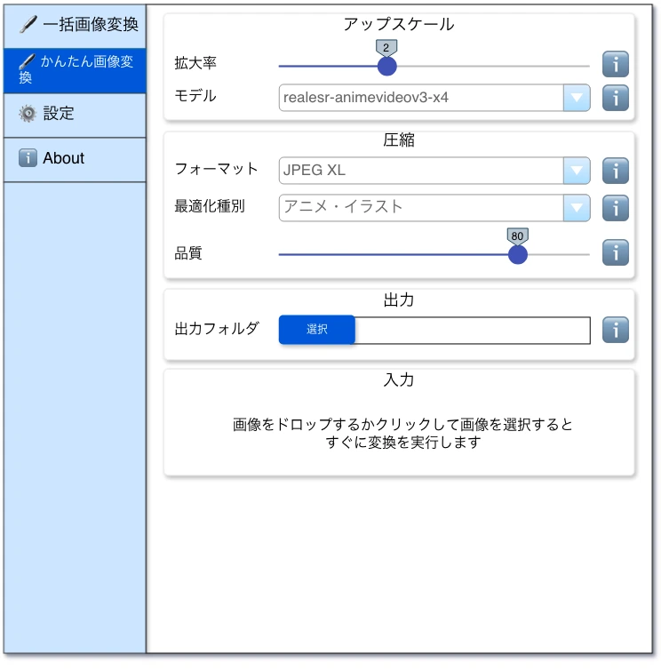

# かんたん画像変換画面

## ✳️ アップスケール

[一括画像変換のアップスケール](./batch-convert.md) と同じUI・機能です。

### ✏️ モデル

[一括画像変換のモデル](./batch-convert.md) と同じUI・機能です。

## ✳️ 圧縮

[一括画像変換の圧縮](./batch-convert.md) と同じUI・機能です。

### ✏️ 最適化種別

[一括画像変換の最適化種別](./batch-convert.md) と同じUI・機能です。

### ✏️ 品質

[一括画像変換の品質](./batch-convert.md) と同じUI・機能です。

## ✳️ 出力

[一括画像変換の出力](./batch-convert.md) と同じUI・機能です。

## ✳️ 入力

### ✏️ 画像のドラッグドロップエリア

#### 画像のドラッグドロップエリアのアクション

- エリアに画像ファイルをドラッグドロップすると、即座に画像変換処理が実行されます。
- 画像以外をドロップしても反応しません。
- エリアをホバーするとカーソルがポインターになります。
- エリアをクリックすると、ファイル選択ダイアログが表示され、ファイルを選択すると即座に画像変換処理が実行されます。
- 画像変換前に、エリアの枠を標準に戻します。
- 画像変換に `成功` した場合、エリアの枠を `緑色` にします。
- 画像変換に `失敗` した場合、エリアの枠を `赤色` にします。

#### サウンドの再生

[一括画像変換のサウンド](./batch-convert.md) と同様に、変換終了時にサウンドを再生します。
